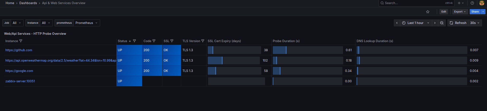
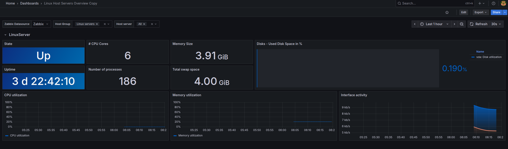
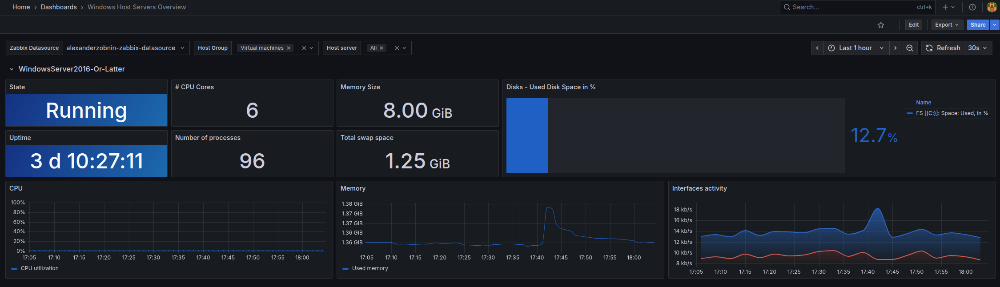

# Basic Observability Baseline
### A practical conceptual self-hosted observability starting point for small infra teams
---

## Baseline Architecture

This repository represents a **conceptual baseline** for a self-hosted observability stack.

It shows how commonly used open-source tools fit together to provide visibility across
infrastructure, services, and uptime checks — without committing to a full production implementation.

Grafana
├─ Prometheus (metrics)
│ └─ Blackbox Exporter (uptime / API / TCP checks)
├─ Zabbix (infrastructure & OS-level monitoring)
└─ Nginx (secure access via reverse proxy)

This baseline is meant to help you **understand the integration boundaries** between tools,
not to replace a fully configured monitoring environment.

---

## Why this exists

If you manage infrastructure **alone or in a small team**, you’ve probably been here before:

- Users report problems before you see them
- You know you need observability, but…
- Every tool solves only part of the problem
- Wiring Grafana, Prometheus, exporters, auth, and access together takes hours
- You’re never sure if you’re “doing it right”

This project exists to answer a simple question:

> **“What’s a sane starting point for self-hosted observability?”**

---

## What this baseline is

**Basic Observability Baseline** is an opinionated reference architecture for building a **self-hosted monitoring and observability stack**.

It focuses on:
- clarity over flexibility
- sane defaults over infinite options
- learning by example instead of theory

This is **not a framework** and **not a SaaS**.  
It’s a practical foundation you can understand, run, and extend.

---

## What’s included (conceptually)

At a high level, the baseline combines:

- **Grafana** for visualization
- **Prometheus** for metrics collection
- **Blackbox Exporter** for uptime, TCP and API checks
- **Zabbix** for infrastructure-level monitoring (Linux & Windows)
- **Nginx** as a secure entry point

The focus is on **how these tools work together**, not on showcasing every feature they have.

---
## What this baseline intentionally does NOT include

To keep this repository focused and easy to reason about, it intentionally does not include:

- production-ready Docker Compose files
- pre-wired networking or reverse proxy configuration
- dashboards or opinionated visualizations
- authentication or access hardening
- ready-made Prometheus jobs or exporters
- Zabbix templates or host definitions

Those pieces are where most of the setup time and friction usually live.

This repository focuses on **architecture and integration boundaries**, not on operational convenience.

---

## Why combine Prometheus and Zabbix?

Prometheus excels at metrics-first workloads and modern services.

Zabbix already provides:
- host-level monitoring
- built-in checks for infrastructure
- a mature model for servers and system metrics

Using both allows each tool to do what it’s best at, without forcing everything into a single model.

This baseline reflects real-world setups used in small self-hosted environments.

---

## What this is NOT

This project is **not**:

- a fully managed observability platform
- a replacement for enterprise SRE tooling
- a zero-config “magic button”
- a tutorial for complete beginners

You’re expected to understand basic monitoring concepts.

---

## Who this is for

This baseline is for you if:

- You manage infrastructure (solo or in a small team)
- You want visibility **before users report issues**
- You prefer self-hosted tools over SaaS platforms
- You want a clean starting point instead of a blank slate

---

## Who this is not for

This is probably **not** for you if:

- You want a hosted SaaS solution
- You don’t want to touch configuration at all
- You enjoy building everything from scratch every time
- You’re looking for enterprise-scale observability out of the box

---

## From baseline to implementation

This repository describes the **architecture and intent** of the baseline.

For those who want to skip the integration work and start with a working reference implementation, 
a complete, ready-to-run version is available separately. It includes:

- a production-ready Docker Compose stack
- pre-integrated services and networking
- SSL-ready Nginx routing
- real dashboards and templates
- step-by-step documentation
- example Prometheus and Blackbox checks

📦 **Want a ready-to-run observability stack?**  
Get the full implementation (Docker Compose + dashboards + docs) here:  
https://payhip.com/b/gTHjP

---
Note: Screenshots below are taken from the full implementation.  
This baseline repository does not include dashboards or visual assets by design.

## Screenshots

> Example dashboards and views included in the full implementation.

---

## Philosophy

This baseline is about **reducing friction**.

It doesn’t try to cover every use case.
It tries to give you a solid place to start.

From there, you decide how far to take it.

---

## License & usage

This repository documents an architectural baseline.

The full implementation, documentation, and packaged stack are distributed separately.
